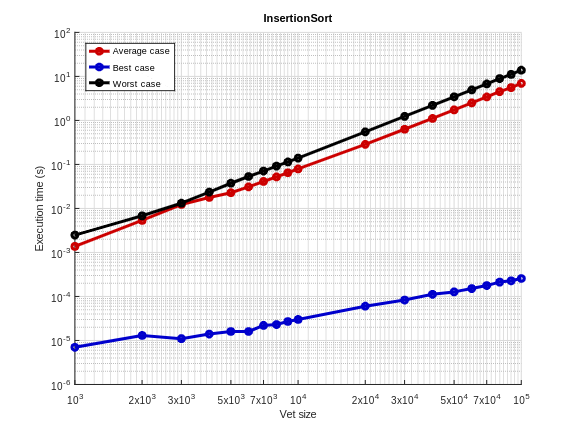
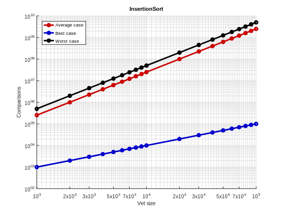

# Intro
O objetivo desse projeto é realizar a implementação dos algoritmos de ordenação `Insertion Sort`, `Selection Sort`, `Merge Sort`, `Heap Sort` e `Quick Sort`, fazendo a análise de complexidade de tempo, comparações e trocas, considerando o melhor caso, caso médio e pior caso de cada um desses algoritmos.
## Executando o projeto:

O arquivo principal a ser executado é o `exec.c`.

Os arquivos `compile.sh` e `clean.sh` são usados para compilar os arquivos necessários para execução e limpá-los. Para tornar esses arquivos executáveis, basta usar os comandos:
```
sudo chmod 777 compile.sh
sudo chmod 777 clean.sh
```
Para executá-los:
```
./compile.sh
./clean.sh
```

Uma vez que todas as dependências são compiladas, é possível executar o código `exec`, passando como argumentos o `nome do executável` que se deseja executar. 
Exemplo:
```
./exec.o mergesort.o
```

Durante a execução, o algoritmo passado como argumento será executado 10 vezes, sendo calculada a média dos resultados. Esse processe se repete para diversos tamanhos de vetor diferente, como explicitado em:
```
  int entry_sizes[ENTRY_QUANTITY] = {
    1000, 2000, 3000, 4000, 5000, 6000, 7000, 8000, 9000,
    10000, 20000, 30000, 40000, 50000, 60000, 70000, 80000, 
    90000, 100000
  };
```
No caso, os tamanhos das entradas foram definidas usando uma escala logarítmica.
Por fim, no arquivo `results.bin`, são armazenados os resultados das médias desses resultados, para todos os valores de entrada mostrados acima.
O arquivo gerado segue o seguinte formato:
```
bt:  | mt: | wt: | bs: | ms: | ws: | bc: | mc: | wc: 
```
Sendo, `bt` best time, `mt` middle time, `wt` worst time, `bs` best swaps, `ms` middle swaps, `ws` worst swaps, `bc` best comparisons, `mc` middle comparisons, `wc` worst comparisons.
# Insertion Sort
O algoritmo Inserion Sort é um algoritmo de ordenação por inserção, que funciona como em um jogo de cartas, quando deseja-se organizá-las de forma ordenada. Ao receber uma nova carta, essa deve ser colocada em sua respectiva posição.
Esse é um algoritmo de fácil implementação, funcionando muito bem para **conjuntos de dados pequenos**.


### Complexidade:
Esse algoritmo tem como melhor caso, um vetor ordenado, tendo uma complexidade de $O(n)$. Como caso médio, um vetor aleatório, com complexidade $O(n^2)$. Por fim, seu pior caso é um vetor inversamente ordenado, e também tem complexidade $O(n^2)$.

| Melhor Caso | Caso Médio | Pior Caso |
|-------------|------------|-----------|
| $$O(n)$$    | $$O(n^2)$$ | $$O(n^2)$$|
<br>

###   `resultados de tempo:`
|Tamanho| Melhor Caso | Caso Médio | Pior Caso | DP Melhor Caso | DP Caso Médio | DP Pior Caso |
|-------|-------------|------------|-----------|----------------|---------------|--------------|
|1000   |0.000011     |0.002167    |0.004182   |0.000004        |0.000499       |0.000892      |
|2000   |0.000017     |0.007814    |0.009874   |0.000008        |0.002384       |0.003203      |
|3000   |0.000013     |0.009569    |0.013471   |0.000003        |0.003937       |0.000512      |
|4000   |0.000015     |0.018785    |0.023489   |0.000003        |0.004000       |0.000441      |
|5000   |0.000015     |0.027829    |0.036772   |0.000003        |0.002070       |0.001442      |
|6000   |0.000017     |0.034587    |0.052905   |0.000002        |0.004542       |0.001249      |
|7000   |0.000023     |0.041217    |0.068538   |0.000006        |0.004611       |0.004385      |
|8000   |0.000023     |0.056260    |0.088156   |0.000006        |0.004638       |0.004914      |
|9000   |0.000026     |0.066985    |0.107166   |0.000007        |0.006131       |0.002178      |
|10000  |0.000027     |0.078784    |0.134806   |0.000005        |0.004339       |0.003147      |
|20000  |0.000053     |0.274741    |0.517515   |0.000010        |0.003888       |0.004421      |
|30000  |0.000072     |0.596632    |1.163152   |0.000003        |0.005159       |0.004691      |
|40000  |0.000098     |1.053718    |2.068533   |0.000004        |0.014639       |0.008394      |
|50000  |0.000125     |1.650559    |3.266188   |0.000004        |0.015481       |0.030108      |
|60000  |0.000142     |2.355638    |4.702376   |0.000008        |0.019581       |0.065899      |
|70000  |0.000176     |3.269323    |6.433713   |0.000021        |0.080499       |0.081745      |
|80000  |0.000193     |4.165521    |8.362144   |0.000010        |0.035346       |0.208307      |
|90000  |0.000223     |5.432963    |10.707689  |0.000015        |0.142498       |0.171613      |
|100000 |0.000244     |6.494386    |13.004524  |0.000013        |0.058193       |0.105184      |



<br>
<br>

### `resultados de comparações:`
|Tamanho| Melhor Caso | Caso Médio | Pior Caso |
|-------|-------------|------------|-----------|
|1000   |999          |253527      |500499     |
|2000   |1999         |998448      |2000999    |
|3000   |2999         |2248876     |4501499    |
|4000   |3999         |3999995     |8001999    |
|5000   |4999         |6248998     |12502499   |
|6000   |5999         |8974766     |18002999   |
|7000   |6999         |12187985    |24503499   |
|8000   |7999         |16010059    |32003999   |
|9000   |8999         |20282588    |40504499   |
|10000  |9999         |25033069    |50004999   |
|20000  |19999        |100076477   |200009999  |
|30000  |29999        |225120875   |450014999  |
|40000  |39999        |399346374   |800019999  |
|50000  |49999        |625374331   |1250024999 |
|60000  |59999        |898906261   |1800029999 |
|70000  |69999        |1222533450  |2450034999 |
|80000  |79999        |1597332826  |3200039999 |
|90000  |89999        |2021889313  |4050044999 |
|100000 |99999        |2497400096  |5000049999 |


<br>
<br>

### `resultados de trocas:`
|Tamanho| Melhor Caso | Caso Médio | Pior Caso |
|-------|-------------|------------|-----------|
|1000   |999          |253527      |500499     |
|2000   |1999         |998448      |2000999    |
|3000   |2999         |2248876     |4501499    |
|4000   |3999         |3999995     |8001999    |
|5000   |4999         |6248998     |12502499   |
|6000   |5999         |8974766     |18002999   |
|7000   |6999         |12187985    |24503499   |
|8000   |7999         |16010059    |32003999   |
|9000   |8999         |20282588    |40504499   |
|10000  |9999         |25033069    |50004999   |
|20000  |19999        |100076477   |200009999  |
|30000  |29999        |225120875   |450014999  |
|40000  |39999        |399346374   |800019999  |
|50000  |49999        |625374331   |1250024999 |
|60000  |59999        |898906261   |1800029999 |
|70000  |69999        |1222533450  |2450034999 |
|80000  |79999        |1597332826  |3200039999 |
|90000  |89999        |2021889313  |4050044999 |
|100000 |99999        |2497400096  |5000049999 |


<br>
<br>

## Selection Sort
Tem como objetivo colocar os menores elementos na nas primeiras posições do vetor, até que a ordenação seja concluída. Para isso, o algoritmo é composto por dois laços, sendo mais externo que controla o índice e o segundo que faz a varredura do vetor.<br>
Esse é um algoritmo **in-place**, simples de ser implementado, sendo bom para **conjuntos de dados pequenos**. Seu problema está em conjuntos grandes de dados, sendo muito ruim nesse caso.<br>
Seu funcionamento pode ser demonstrado abaixo:


### Complexidade:
Outro ponto importante desse algorítmo, é que esse não possuí melhor ou pior caso, sendo todos $O(n²)$, já que os dois loops sempre serão executados.
| Melhor Caso | Caso Médio | Pior Caso |
|-------------|------------|-----------|
| $$O(n^2)$$  | $$O(n^2)$$ | $$O(n^2)$$|
<br>

### `resultados de tempo:`
|Tamanho| Melhor Caso | Caso Médio | Pior Caso | DP Melhor Caso | DP Caso Médio | DP Pior Caso |
|-------|-------------|------------|-----------|----------------|---------------|--------------|
|1000   |0.001776     |0.001954    |0.001647   |0.000811        |0.000906       |0.000657      |
|2000   |0.004957     |0.008119    |0.003765   |0.001066        |0.002975       |0.000197      |
|3000   |0.008207     |0.014469    |0.008133   |0.000362        |0.002692       |0.000172      |
|4000   |0.014764     |0.023644    |0.014653   |0.001176        |0.003483       |0.000691      |
|5000   |0.022579     |0.029435    |0.023242   |0.000848        |0.003074       |0.000716      |
|6000   |0.032562     |0.039787    |0.032427   |0.000898        |0.003624       |0.001116      |
|7000   |0.043733     |0.051300    |0.044482   |0.001428        |0.002369       |0.000973      |
|8000   |0.057052     |0.061920    |0.057157   |0.001194        |0.004306       |0.001379      |
|9000   |0.071594     |0.078010    |0.070800   |0.001208        |0.004149       |0.000911      |
|10000  |0.087695     |0.094605    |0.086660   |0.001666        |0.005228       |0.001450      |
|20000  |0.338148     |0.347386    |0.337202   |0.005306        |0.008252       |0.005633      |
|30000  |0.746420     |0.748919    |0.751096   |0.011233        |0.006105       |0.012940      |
|40000  |1.339960     |1.358792    |1.337883   |0.046668        |0.041556       |0.049191      |
|50000  |2.066474     |2.076138    |2.069322   |0.025953        |0.016606       |0.030952      |
|60000  |3.069226     |3.064959    |3.089263   |0.097612        |0.088956       |0.121558      |
|70000  |4.008881     |4.029718    |4.000716   |0.213298        |0.219824       |0.238830      |
|80000  |4.893991     |4.941121    |4.894962   |0.029108        |0.059232       |0.033234      |
|90000  |6.233660     |6.236459    |6.220954   |0.037623        |0.044807       |0.050262      |
|100000 |7.687194     |7.692758    |7.693500   |0.053724        |0.039498       |0.042822      |

<br>

**GRAFICO AQUI!**

<br>

### `resultados de comparações:`
|Tamanho| Melhor Caso | Caso Médio | Pior Caso |
|-------|-------------|------------|-----------|
|1000   |499500       |499500      |499500     |
|2000   |1999000      |1999000     |1999000    |
|3000   |4498500      |4498500     |4498500    |
|4000   |7998000      |7998000     |7998000    |
|5000   |12497500     |12497500    |12497500   |
|6000   |17997000     |17997000    |17997000   |
|7000   |24496500     |24496500    |24496500   |
|8000   |31996000     |31996000    |31996000   |
|9000   |40495500     |40495500    |40495500   |
|10000  |49995000     |49995000    |49995000   |
|20000  |199990000    |199990000   |199990000  |
|30000  |449985000    |449985000   |449985000  |
|40000  |799980000    |799980000   |799980000  |
|50000  |1249975000   |1249975000  |1249975000 |
|60000  |1799970000   |1799970000  |1799970000 |
|70000  |2449965000   |2449965000  |2449965000 |
|80000  |3199960000   |3199960000  |3199960000 |
|90000  |4049955000   |4049955000  |4049955000 |
|100000 |4999950000   |4999950000  |4999950000 |

<br>

**GRAFICO AQUI!**

<br>

### `resultados de trocas:`
|Tamanho| Melhor Caso | Caso Médio | Pior Caso |
|-------|-------------|------------|-----------|
|1000   |1998         |1998        |1998       |
|2000   |3998         |3998        |3998       |
|3000   |5998         |5998        |5998       |
|4000   |7998         |7998        |7998       |
|5000   |9998         |9998        |9998       |
|6000   |11998        |11998       |11998      |
|7000   |13998        |13998       |13998      |
|8000   |15998        |15998       |15998      |
|9000   |17998        |17998       |17998      |
|10000  |19998        |19998       |19998      |
|20000  |39998        |39998       |39998      |
|30000  |59998        |59998       |59998      |
|40000  |79998        |79998       |79998      |
|50000  |99998        |99998       |99998      |
|60000  |119998       |119998      |119998     |
|70000  |139998       |139998      |139998     |
|80000  |159998       |159998      |159998     |
|90000  |179998       |179998      |179998     |
|100000 |199998       |199998      |199998     |

<br>

**GRAFICO AQUI!**

<br>
